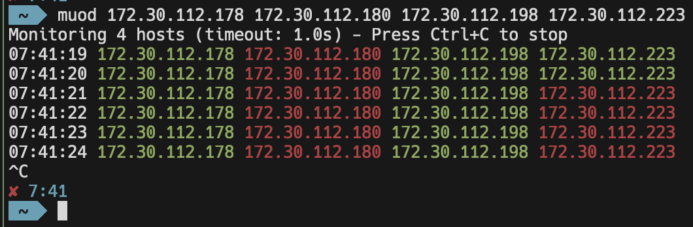

# MUOD - Multiple Up or Down

A Go application that continuously monitors multiple hosts using ICMP echo requests (ping). The application is designed to work without requiring root/administrator privileges on any platform.

Perfect for watching multiple hosts or VMs during maintenance windows, reboots, or deployments. The color-coded output makes it easy to track when systems go down and come back up in real-time, without needing to run multiple terminal windows or scripts.



## Features

- Pure ICMP echo request monitoring (no TCP or other protocols)
- No root/administrator privileges required on any platform
- Configurable timeout intervals (supports decimal values)
- Default 5-second check interval
- Precise timeout handling with RTT measurements
- Real-time status reporting with color-coded output
- Timestamps enabled by default (can be disabled)
- Configurable number of ping rounds
- Green for up, red for down
- Cross-platform support (Linux, macOS, Windows)
- YAML configuration file support with XDG Base Directory compliance

## Project Structure

```
muod/
├── cmd/
│   └── muod/           # Main application code
│       └── main.go     # Entry point and CLI handling
├── pkg/
│   ├── ping/           # Reusable ping package
│   │   ├── ping.go     # Common interface and types
│   │   ├── ping_unix.go    # Unix implementation
│   │   └── ping_windows.go # Windows implementation
│   └── config/         # Configuration management
│       └── config.go   # YAML config support
├── examples/           # Example configurations
│   └── config.yaml     # Example YAML config
├── images/             # Documentation images
└── README.md
```

## Configuration

MUOD follows the XDG Base Directory Specification for configuration files. The configuration file is searched in the following locations:

1. Custom path specified with `-f/--config` flag
2. `$XDG_CONFIG_HOME/muod/muod.yaml` (typically `~/.config/muod/muod.yaml`)

Example configuration file:
```yaml
# Default timeout for ping requests
default_timeout: 5s

# Whether to show timestamps by default
show_timestamps: true

# Default number of ping rounds (-1 for infinite)
default_count: -1

# Custom color settings (ANSI escape codes)
colors:
  success: "\033[32m"  # Green
  failure: "\033[31m"  # Red

# Default hosts to monitor if none specified
default_hosts:
  - google.com
  - github.com
```

Configuration options:
- `default_timeout`: Default timeout for ping requests (supports time units: s, ms)
- `show_timestamps`: Whether to show timestamps by default (true/false)
- `default_count`: Default number of ping rounds (-1 for infinite)
- `colors`: Custom ANSI color codes for status display
- `default_hosts`: List of hosts to monitor if none specified on command line

Command-line flags override configuration file settings.

## Platform-Specific Implementation Details

### Unix-like Systems (Linux, macOS, BSD)
- Uses unprivileged UDP sockets for ICMP
- Implemented in `pkg/ping/ping_unix.go`
- Uses `golang.org/x/net/icmp` package for ICMP message handling
- Works out of the box without special permissions

### Windows
- Uses Windows ICMP Helper API (iphlpapi.dll)
- Implemented in `pkg/ping/ping_windows.go`
- Uses `IcmpCreateFile` and `IcmpSendEcho` APIs
- No administrator privileges required
- Color output supported in modern Windows Terminal

## Installation

```bash
# Clone the repository
git clone https://github.com/fmattheus/muod.git
cd muod

# Build for your platform
go build -o muod ./cmd/muod

# Or build for all supported platforms
make build
```

The `make build` command will create binaries for all supported platforms in the `dist` directory:
- Linux (amd64, arm64)
- macOS (amd64, arm64)
- Windows (amd64)

You can also use `make clean` to remove build artifacts.

## Usage

```bash
# Basic monitoring (5s interval)
./muod google.com github.com

# Fast 1s interval
./muod -t 1 google.com github.com

# Very fast 0.5s interval
./muod -t 0.5 google.com github.com

# Run 10 rounds only
./muod -c 10 google.com github.com

# Without timestamps
./muod -p google.com github.com

# With debug output
./muod -d google.com github.com

# Use custom config file
./muod -f /path/to/config.yaml

# Use default hosts from config
./muod
```

### Command Line Options

```
Options:
  -d, --debug          Enable debug output
  -t, --timeout float  Timeout in seconds (e.g., 5, 1, 0.5) (default from config)
  -p, --plain          Plain output without timestamps (default from config)
  -c, --count int      Number of ping rounds (-1 for infinite) (default from config)
  -f, --config string  Path to config file (default: $XDG_CONFIG_HOME/muod/muod.yaml)
```

## Requirements

- Go 1.21 or higher
- No additional dependencies for Windows
- `golang.org/x/net/icmp` package for Unix systems
- `gopkg.in/yaml.v3` package for configuration

## How it Works

1. **DNS Resolution**
   - Resolves all hostnames to IPv4 addresses at startup
   - Fails fast if any host cannot be resolved

2. **Platform Detection**
   - Automatically selects appropriate implementation using build tags
   - Unix: Creates UDP-based ICMP socket
   - Windows: Initializes ICMP Helper API

3. **Monitoring Loop**
   - Sends ICMP echo requests to all hosts
   - Measures round-trip time (RTT)
   - Color codes output based on response:
     - Green: Host responded within timeout
     - Red: Host failed to respond
   - Adds timestamps (unless disabled)
   - Repeats based on count parameter

4. **Resource Management**
   - Properly closes sockets/handles on exit
   - Handles Ctrl+C gracefully
   - Cleans up resources even on errors

## Using the Ping Package

The `pkg/ping` package can be used independently in other projects:

```go
import "github.com/fmattheus/muod/pkg/ping"

// Create a new pinger
pinger, err := ping.New()
if err != nil {
    log.Fatal(err)
}
defer pinger.Close()

// Resolve hosts
hosts, err := ping.ResolveHosts([]string{"example.com"})
if err != nil {
    log.Fatal(err)
}

// Ping with timeout
rtt, err := pinger.Ping(hosts[0].IPAddr, 5*time.Second)
if err != nil {
    log.Printf("Host is down: %v", err)
} else {
    log.Printf("Host is up (RTT: %v)", rtt)
}
```

## Contributing

Contributions are welcome! Please feel free to submit a Pull Request. # muod
